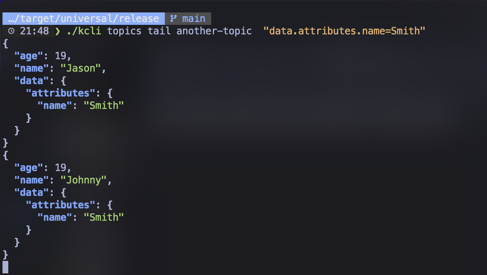

# kcli

`kcli` is a command-line interface (CLI) tool written in Rust. It provides utilities to monitor Kafka topics and consumers.

## Features

- **Topic Monitor**: Monitor Kafka topics, list all topics, get details of a topic, create, delete, and tail topics.
- **Broker Monitor**: Monitor Kafka brokers.
- **Consumer Group Monitor**: Monitor Kafka consumer groups.

## Installation

### Using Cargo

To install `kcli` using Cargo, you can use the following command:

```sh
cargo install kcli
```

### Using Homebrew (macOS)
To install kcli on macOS using Homebrew, you can use the following commands:

```sh
brew tap keaz/homebrew
brew install kcli
```

## Usage
Here are some examples of how to use kcli:

### Config Commands
#### Set the active environment
```sh
kcli config active --environment <environment_name>
```

### Topic Commands
#### List all topics
```sh
kcli topic list
```

#### Get details of a topic
```sh
kcli topics details <topic_name>
```

#### Create a topic
```sh
kcli topics create <topic_name> --partitions <num_partitions> --replication-factor <replication_factor>
```

#### Delete a topic
```sh
kcli topics delete <topic_name>
```

#### Tail a topic
```sh
kcli topics tail <topic_name>
```

#### Tail a topic with filters
```sh
kcli topics tail  <topic_name>  "<filter>"
```

Example:
```sh
kcli topics tail another-topic  "data.attributes.name=19"
```


## Contributing
Contributions are welcome! Please open an issue or submit a pull request.

## License
This project is licensed under the GNU General Public License v3.0. See the [LICENSE](LICENSE) file for details.

## Contact
For any questions or feedback, please contact kasun.ranasinghe@icloud.com.

