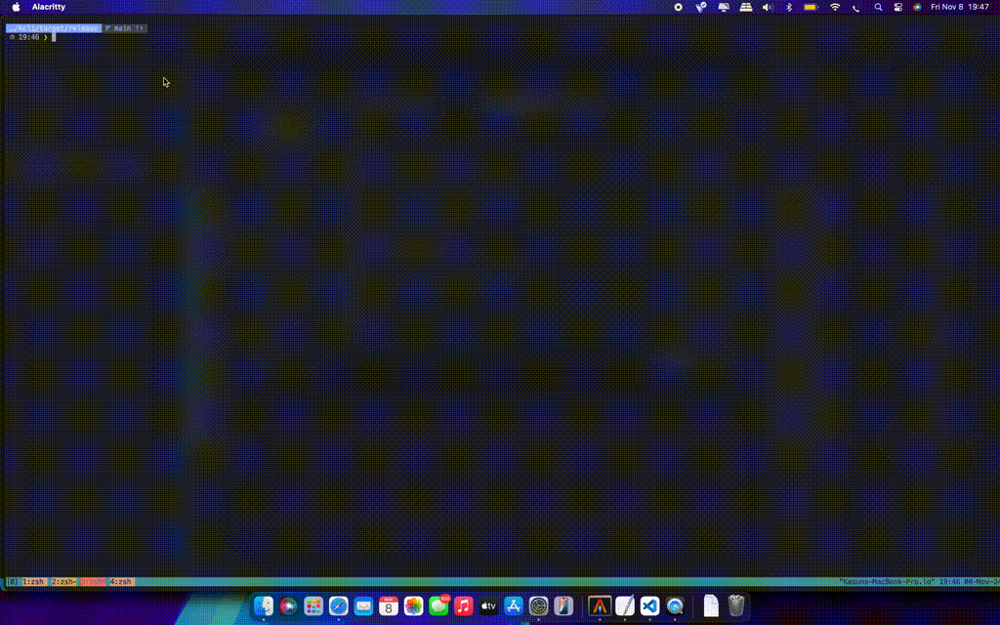

# kfcli

`kfcli` is a command-line interface (CLI) tool written in Rust. It provides utilities to monitor Kafka topics and consumers.


## Features

- **Topic Monitor**: Monitor Kafka topics, list all topics, get details of a topic, create, delete, and tail topics.
- **Broker Monitor**: Monitor Kafka brokers.
- **Consumer Group Monitor**: Monitor Kafka consumer groups.

## Task Completed
- [X] MVP
- [X] Support JSON
- [X] Tail Topics
- [X] Inspect Topic/Groups
- [X] Manage different Environments
- [ ] Support XML
- [ ] Unit tests
- [ ] Performance improvement
- [ ] Documentation


## Installation

### Using Cargo

To install `kfcli` using Cargo, you can use the following command:

```sh
cargo install kfcli
```

### Using Homebrew (macOS)
To install kfcli on macOS using Homebrew, you can use the following commands:

```sh
brew tap keaz/homebrew
brew install kfcli
```

## Usage
Here are some examples of how to use kfcli:

### Config Commands
#### Set the active environment
```sh
kfcli config active <environment_name>
```

### Topic Commands
#### List all topics
```sh
kfcli topic list
```

#### Get details of a topic
```sh
kfcli topics details <topic_name>
```

#### Create a topic
```sh
kfcli topics create <topic_name> --partitions <num_partitions> --replication-factor <replication_factor>
```

#### Delete a topic
```sh
kfcli topics delete <topic_name>
```

#### Tail a topic
```sh
kfcli topics tail <topic_name>
```

#### Tail a topic with filters
```sh
kfcli topics tail  <topic_name>  "<filter>"
```

Example:
```sh
kfcli topics tail another-topic  "data.attributes.name=19"
```


## Contributing
Contributions are welcome! Please open an issue or submit a pull request.

## License
This project is licensed under the GNU General Public License v3.0. See the [LICENSE](LICENSE) file for details.

## Contact
For any questions or feedback, please contact kasun.ranasinghe@icloud.com.

